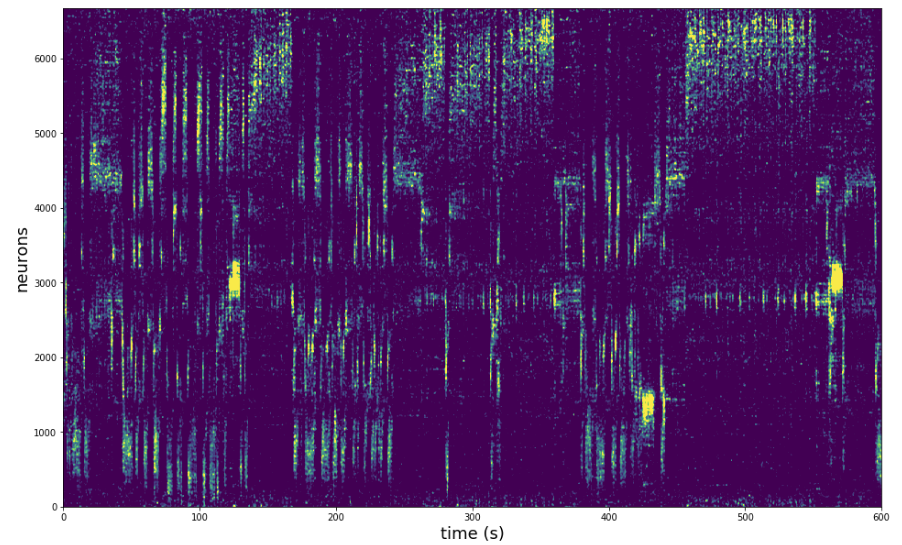

# rastermap

This algorithm computes a 1D or 2D embedding of neural activity. It assumes that the spike matrix `S` is neurons by timepoints. We have a python 3 and a matlab implementation. See the [demos](rastermap/demos/) for jupyter notebooks using it, and some example data.

Here is what the output looks like for a segment of a mesoscope recording (2.5Hz sampling rate) (sorted in neural space, but not time space):



Here is what the output looks like for a recording of 64,000 neurons in a larval zebrafish (data [here](https://figshare.com/articles/Whole-brain_light-sheet_imaging_data/7272617/1), thanks to Chen, Mu, Hu, Kuan et al / Ahrens lab for sharing!). The upper left plot is the 2D embedding with boxes around clusters (which the user draws in the GUI). The plot on the right shows the activity of the clusters. The lower left plot is a Z-stack of the neurons in the tissue, colored according to their 2D position in the Rastermap embedding.


## Installation

You can download the github folder and run the following inside the folder to start the GUI:
```
python -m rastermap
```
This package was written for Python 3 and relies on the awesomeness of **numpy**, **scipy**, **PyQt5**, **PyQt5.sip** and **pyqtgraph**. You can pip install or conda install all of these packages. If having issues with **PyQt5**, then make an Anaconda environment and try to install within it.

You can pip install the outdated package here (no GUI or 2D suppport):
```
pip install rastermap
```

## Using (python) rastermap

### Running in the GUI

Save your data into an npy file that is just a matrix that is neurons x features. Then "Load data matrix" and choose this file. Next click "Run embedding algorithm" and run with TWO components if you want to visualize it in the GUI. The embedding will pop up in the GUI when it's done running, and save the embedding in the same folder as your data matrix with the name "embedding.npy". Loading the embedding:

```
import numpy as np
model = np.load('embedding.npy')
model = model.dict()
y = model['embedding'] # neurons x n_components
```

To draw ROIs around points in the GUI, you draw lines and then resize them. The neurons' activity traces then show up on the right side of the GUI sorted along this "line axis" that you've drawn. To start drawing a line, hold down SHIFT and click for the first point, click for the endpoint, and then resize the box and click again to complete it. Do NOT hold down the mouse, that will just drag you all over the place :) To update the plot on the right with the selected cells on the left, hit the SPACE key. You can delete the last ROI with the DELETE button, or delete a specific ROI by clicking inside that ROI and holding down ALT. You can save the ROIs you've drawn with the "save ROIs" button.

NOTE: If you are using suite2p "spks.npy", then the GUI will automatically use the "iscell.npy" file in the same folder to subsample your recording with the chosen cells.

### Running the code

rastermap can be run the same way as the T-SNE embedding algorithm or other algorithms in scikit-learn. **Rastermap** is a class which has functions *fit*, *fit_transform*, and *transform* (embeds new points into original embedding).

**(input should be n_samples x n_features like t-sne, etc)**

```
# >> from github <<
import sys
sys.path.append('/media/carsen/DATA2/Github/rastermap/rastermap/')
from mapping import Rastermap

# >> from pip <<
from rastermap import Rastermap

model = Rastermap(n_components=1, n_X=30, nPC=200, init='pca')

# fit does not return anything, it adds attributes to model
# attributes: embedding, u, s, v, isort1

model.fit(sp)
plt.imshow(sp[model.isort1, :])

# fit_transform returns embedding (upsampled cluster identities)
embedding = model.fit_transform(sp)

# transform can be used on new samples with the same number of features as sp
embed2 = model.transform(sp2)
```

## Parameters

Rastermap first takes the specified PCs of the data, and then embeds them into n_X clusters. It returns upsampled cluster identities (n_X x upsamp). Clusters are also computed across Y (n_Y) and smoothed, to help with fitting.

- **n_components** : int, optional (default: 2)
        dimension of the embedding space
- **n_X** : int, optional (default: 40)
        size of the grid on which the Fourier modes are rasterized
- **n_Y** :  int, optional (default: 0)
        number of Fourier components in Y: will be used to smooth data for better PCs
- **nPC**  : nparray, int, optional (default: 400)
        how many of the top PCs to use during optimization
- **alpha** : float, optional (default: 1.0)
        exponent of the power law enforced on component n as: 1/(K+n)^alpha
- **K** :  float, optional (default: 1.0)
        additive offset of the power law enforced on component n as: 1/(K+n)^alpha
- **init** : initialization of algorithm (default: 'pca')
        can use 'pca', 'random', or a matrix n_samples x n_components
       
## Outputs

Rastermap model has the following attributes after running 'fit':
- **embedding** : array-like, shape (n_samples, n_components)
        Stores the embedding vectors.
- **u,sv,v** : singular value decomposition of data S, potentially with smoothing
- **isort1** : sorting along first dimension (n_samples) of matrix
- **isort2** : sorting along second dimension (n_features) of matrix (if n_Y > 0)
- **cmap**  : correlation of each item with all locations in the embedding map (before upsampling)
- **A**     :    PC coefficients of each Fourier mode


## Requirements

This package was written for Python 3 and relies on **numpy** and **scipy**. The Python3.x Anaconda distributions will contain all the dependencies.

## Matlab

The matlab version requires Matlab 2016a or later. If you want to use the GPU acceleration (useGPU=1), then you need an NVIDIA GPU and the Parallel Computing Toolbox. Otherwise, I don't think it requires any additional toolboxes, but please let me know if it does in the issues.

The matlab code needs to be cleaned up but the main function to call is `mapTmap.m`. This function is used in the example script `loadFromPython.m` (loads suite2p outputs, requires [npy-matlab](https://github.com/kwikteam/npy-matlab)).
